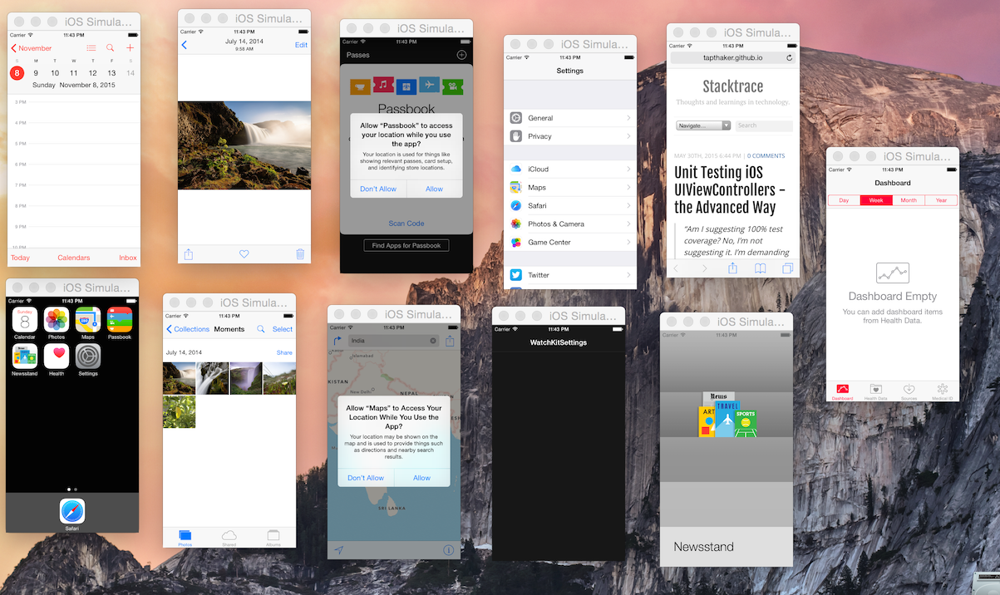

# FBSimulatorClient
FBSimulatorClient is a simple way to interface talk to [FBSimulatorControl](https://github.com/facebook/FBSimulatorControl) framework to control  using Rest Web Services.
FBSimulatorControl is a Mac OS X library for managing and manipulating iOS Simulators.

## Usage (•ิ_•ิ)?

Once your build the app, you can launch it in command line with the following command:
`./FBSimulatorClient.app/Contents/MacOS/FBSimulatorClient --start-server --port 9898`

Following are the endpoints which can be hit 

1. *Launch the simulator*
  - endpoint : /simulator/launch
  - method   : POST
  - body     : `{"simulatorType":"iPhone5s", "appPath":"/path/to/app"}`
  - curl  : `curl -H "Content-Type: application/json" -X POST -d '{"simulatorType":"iPhone 5s","appPath":"/Users/tapan/awesome-app/Debug-iphonesimulator/awesome.app"}' localhost:9898/simulator/launch`

2. *Kill the simulator(s)*
  - endpoint : /simulator/kill
  - method   : POST
  - body     : `{"processIdentifer" :"Process identifier of the sim to kill"} or nothing to kill all simulators`
  - curl  : `url -H "Content-Type: application/json" -X PUT -d '{"processIdentifier":"6410"' localhost:9898/control`

3. *Quit the application*
  - endpoint : /control
  - method   : PUT
  - body     : `{"command" : "quit"}`
  - curl  : `curl -H "Content-Type: application/json" -X PUT -d '{"command":"quit"}' localhost:9898/control`

There are obviously more things to be done. But its a start. Look at the power of this thing - 

## Contact

Follow me on Twitter ([@tapthaker](https://twitter.com/tapthaker))

## Problems ? (✖╭╮✖)

* Add a new issue on github.
* Add a question on stackoverflow and mention me in a tweet with the link.

## To improve

* More control on the simulators. 
* Introduce FBSimulatorControl as podfile instead of prebuild framework
* Integrate this with some automation frameworks like [Calabash](http://calaba.sh/) for parallel execution of features
* Stability issues

